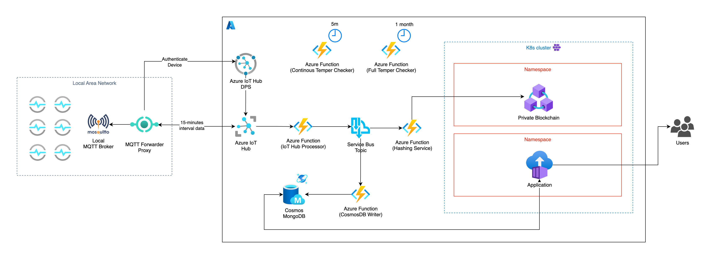
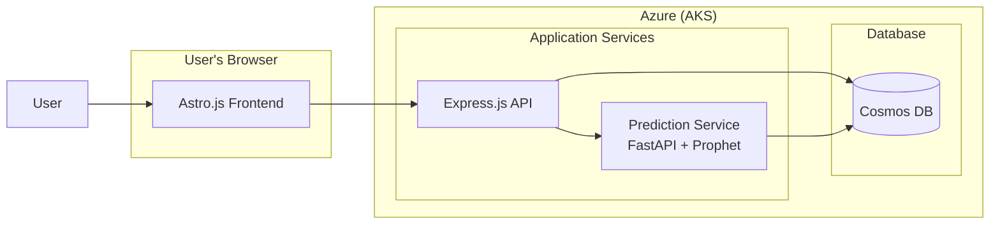

# Block of Energy

Platform which leverages Blockchain technology to provide temper-free storing of records about energy consumption in
a given home, office, university campus or industry center.

## Table of Contents

- [Block of Energy](#block-of-energy)
  - [Table of Contents](#table-of-contents)
  - [Architecture](#architecture)
  - [Key Features](#key-features)
  - [Project Structure](#project-structure)
  - [Application Architecture](#application-architecture)
  - [Technologies Used](#technologies-used)
  - [Predictive Analytics](#predictive-analytics)
  - [Cost Estimation](#cost-estimation)
  - [Tamper Auditing Strategy](#tamper-auditing-strategy)
  - [Hash Verification Proof](#hash-verification-proof)
  - [CI/CD](#cicd)
  - [Local Development](#local-development)
  - [Application Screenshots](#application-screenshots)
  - [Future Improvements](#future-improvements)

## Architecture

The system is designed with a cloud-native, event-driven architecture hosted on Microsoft Azure. The data flows from the local sensor network to the cloud, where it is processed, stored, and made available to users through a web application. The integrity of the data is ensured by anchoring it to a private blockchain.



### Data Flow Explained

The data flow can be broken down into the following steps:

1.  **Data Ingestion from Local Network:**
    *   Energy consumption data is collected by smart sensors within a Local Area Network (LAN).
    *   This data is published to a local **Mosquitto MQTT Broker**.
    *   An **MQTT Forwarder Proxy** acts as a secure bridge between the local network and the Azure cloud. It authenticates the device with **Azure IoT Hub DPS (Device Provisioning Service)** to establish a secure and trusted connection.
    *   The proxy then forwards the sensor data to **Azure IoT Hub** in 15-minute intervals.

2.  **Real-time Data Processing:**
    *   Upon receiving data, the **Azure IoT Hub** triggers the `process_iot_hub_message` **Azure Function**.
    *   This function acts as an initial processor and forwards the message to an **Azure Service Bus Topic**. This decouples the data ingestion from the subsequent processing steps, allowing for greater scalability and resilience.

3.  **Data Persistence and Blockchain Anchoring:**
    *   The **Service Bus Topic** fans out the message to two separate **Azure Functions**:
        *   The `cosmos_db_writer` function subscribes to the topic and writes the raw sensor data to an **Azure Cosmos DB** instance (using the MongoDB API) for long-term storage and querying by the application.
        *   The `hash_and_store_to_ledger` function also subscribes to the topic. It calculates a cryptographic hash of the data and stores this hash on a **Private Blockchain** (Hyperledger Fabric). This process anchors the data to an immutable ledger, providing a verifiable audit trail.

4.  **Application and User Access:**
    *   Both the **Private Blockchain** and the user-facing **Application** are hosted within a **Kubernetes (K8s) cluster** on Azure (AKS).
    *   They reside in separate namespaces for security and management purposes.
    *   **Users** interact with the web application to view energy consumption data, reports, and dashboards. The application queries the **Cosmos DB** for the data to display.

5.  **Continuous and Full Temper Auditing:**
    *   The integrity of the data is continuously verified by two automated **Azure Functions**:
        *   The `continuous_temper_auditor` runs every 5 minutes. It checks the most recent data to provide near real-time detection of any tampering.
        *   The `full_temper_auditor` runs once a month. It performs a comprehensive validation of the previous month's data, ensuring historical integrity.
    *   These auditors work by re-calculating the hashes of the data stored in Cosmos DB and comparing them with the hashes stored on the blockchain.

## Key Features

- **Secure and Tamper-Free Data Logging:** Utilizes Hyperledger Fabric to ensure that all energy consumption records are immutable and verifiable.
- **Real-time Data Processing:** Azure Functions process IoT data as it arrives, providing near real-time insights.
- **Automated Data Auditing:** A two-layered auditing system automatically verifies the integrity of the data, with both continuous and periodic checks.
- **Predictive Analytics:** Machine learning-powered forecasting using Prophet and anomaly detection using Isolation Forest to identify unusual consumption patterns.
- **Cost Estimation:** Real-time cost calculations based on Macedonia EVN progressive block tariffs with low/high tariff time-of-use pricing.
- **Per-Device Breakdown:** Detailed consumption analysis per device with percentage shares and peak power tracking.
- **Data Visualization Dashboard:** A single-page tabbed interface for viewing consumption data, forecasts, anomalies, and detailed reports.
- **Scalable and Modular Architecture:** The use of microservices, containers, and a forwarder proxy allows for independent scaling and easy integration of new components.

## Project Structure

The repository is organized into the following directories:

- `app/`: Contains the source code for the frontend and backend API of the web application.
  - `api/`: Express.js backend with REST API, cost estimation, and prediction proxy services.
  - `frontend/`: Astro.js single-page application with tabbed interface for reports and charts.
- `predictive-model/`: FastAPI microservice for machine learning predictions.
  - Prophet-based energy consumption forecasting with confidence intervals.
  - Isolation Forest anomaly detection with severity classification.
  - Automated hyperparameter tuning with time-series cross-validation.
- `infra/`: Includes all Terraform scripts for provisioning Azure infrastructure, as well as the source code for the Azure Functions.
- `hyperledger-fabric/`: Holds the configuration files and chaincode for the Hyperledger Fabric blockchain network.
- `forward-proxy/`: Contains the implementation of the MQTT forwarder proxy.
- `tools/`: Development and testing utilities:
  - `energy-data-simulator/`: Multi-device MQTT simulator (dishwasher, boiler, AC, washing machine, 3-phase meter).
  - `local-mqtt-processor/`: Bridge between MQTT and MongoDB for local development.
  - `verify-hash/`: Tool for verifying data hashes against the blockchain.
- `docs/`: Stores project documentation, including architecture diagrams and application screenshots.
- `.github/`: Contains CI/CD workflow definitions for GitHub Actions.

## Application Architecture

The web application is composed of a frontend, backend API, and predictive model service, all running in the Kubernetes cluster.



## Technologies Used

- **Cloud Provider:** Microsoft Azure
- **Backend:** Node.js, Express.js, Python (FastAPI), Go
- **Frontend:** Astro, React, Tailwind CSS
- **Database:** Azure Cosmos DB (MongoDB API)
- **Machine Learning:** Prophet (forecasting), scikit-learn (Isolation Forest anomaly detection)
- **Blockchain:** Hyperledger Fabric
- **Infrastructure as Code:** Terraform (OpenTofu)
- **Messaging:** MQTT (Eclipse Mosquitto), Azure Service Bus
- **Containerization:** Docker, Kubernetes (AKS)

## Predictive Analytics

The platform includes a dedicated microservice for machine learning-powered analytics, providing energy consumption forecasting and anomaly detection.

### Energy Forecasting

Uses Facebook Prophet to predict future energy consumption with confidence intervals:

- **Forecast Horizons:** 12, 24, or 48 hours ahead
- **Seasonality:** Captures daily and weekly consumption patterns
- **Confidence Bands:** Upper and lower bounds for prediction uncertainty
- **Data Requirements:** Minimum 7 days of historical data for accurate predictions

### Anomaly Detection

Uses Isolation Forest algorithm to identify unusual consumption patterns:

| Anomaly Type | Description |
| :--- | :--- |
| **Spike** | Unusually high power consumption |
| **Dip** | Unexpectedly low consumption |
| **Pattern Change** | Deviation from normal usage patterns |

Features include:
- **Sensitivity Control:** Adjustable detection threshold (0.1 - 1.0)
- **Severity Levels:** Low, medium, and high classifications
- **Feature Engineering:** 8 engineered features including cyclical time encoding and 24-hour rolling statistics

### Automated Tuning

The prediction models are automatically optimized through:
- Weekly hyperparameter tuning using grid search
- Time-series cross-validation for model selection
- Cached optimal parameters for consistent predictions

## Cost Estimation

Real-time cost calculations based on Macedonia EVN electricity tariffs.

### Progressive Block Tariff

| Block | Consumption Range | Rate (MKD/kWh) |
| :--- | :--- | :--- |
| Block 1 | 0 - 210 kWh | 4.44 |
| Block 2 | 211 - 630 kWh | 5.57 |
| Block 3 | 631 - 1050 kWh | 7.43 |
| Block 4 | 1051+ kWh | 18.30 |

### Time-of-Use Pricing

- **Low Tariff (1.98 MKD/kWh):**
  - Weekdays: 13:00-15:00 and 22:00-07:00
  - Weekends: Saturday 22:00 to Monday 07:00
- **High Tariff:** Standard block rates during other hours

### Features

- Per-reading cost calculation with tariff type identification
- Daily cost projections with confidence levels
- Monthly cost breakdown by consumption block
- Configurable rates via environment variables

## Tamper Auditing Strategy

To ensure the integrity of the stored data, a two-layered automated auditing strategy is implemented using two separate Azure Functions:

| Auditor | Frequency | Scope | Purpose |
| :--- | :--- | :--- | :--- |
| **Continuous Auditor** | Every 5 minutes | Last 5 minutes of data | Provides near real-time detection of any tampering with recent data. |
| **Full Auditor** | Monthly (Last day of the month) | Previous month's data | Performs a comprehensive historical validation of the entire previous month's data. |

## Hash Verification Proof

The following image demonstrates the process of verifying the integrity of a message. The top pane shows the calculation of the SHA256 hash of a message. The bottom pane shows a query to the Hyperledger Fabric network to retrieve the hash stored for that message. The two hashes match, proving that the message has not been tampered with.


## CI/CD

The project utilizes GitHub Actions for continuous integration and continuous deployment. The workflows, located in the `.github/workflows` directory, automate the following processes:

- **Deployment of Azure Functions:** Automatically deploys the Azure Functions on pushes to the `main` branch.
- **Security Scanning:** Integrates CodeQL and tfsec to perform static analysis and identify potential security vulnerabilities in the codebase and infrastructure configuration.

## Local Development

Run the entire platform locally without Azure dependencies using Docker Compose.

### Prerequisites

- **Docker** and **Docker Compose**

### Quick Start

```bash
# Start everything (MongoDB, MQTT, API, Frontend, Simulator)
docker compose up -d

# View logs
docker compose logs -f
```

That's it! All services will start automatically:

- MongoDB and Mosquitto MQTT broker (infrastructure)
- MQTT Processor (bridges sensor data to MongoDB)
- API Server (Express.js backend)
- Prediction Service (FastAPI + Prophet)
- Frontend (Astro.js)
- Energy Simulator (generates multi-device test data)

### Access the Application

| Service | URL |
| :--- | :--- |
| Frontend | <http://localhost:4321> |
| API | <http://localhost:3000> |
| Prediction Service | <http://localhost:8000> |
| MongoDB | `mongodb://localhost:27017` |
| MQTT Broker | `mqtt://localhost:1883` |

### Stop Services

```bash
docker compose down

# To also remove volumes (reset data)
docker compose down -v
```

### Optional: Blockchain Integration

For local blockchain development with Hyperledger Fabric:

```bash
cd hyperledger-fabric
./bootup.sh
```

See [hyperledger-fabric/README.md](./hyperledger-fabric/README.md) for detailed setup.

## Application Screenshots

### Daily Report


### Weekly Report


### Monthly Report


### Consumption Chart


### Forecast Chart


### Anomalies view

TODO: Add image

## Future Improvements

- Migrate `Forwarder Proxy` to use a language with a better throughput capabilities (like GoLang, etc.).
